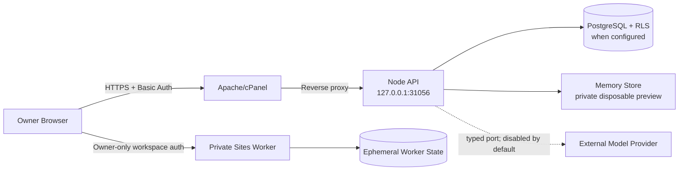

# Threat Model & Data Flow v1.0

## Scope

این مدل نسخه فعلی Single-owner Private Preview، Node/PM2 روی cPanel، PostgreSQL
اختیاری و Preview خصوصی Sites را پوشش می‌دهد. Public/Multi-user release تا Session
واقعی، دیتابیس پایدار و drill عملیاتی خارج از Scope مجاز نیست.

## Data flow و Trust Boundaryها

Trust Boundaryها:

- اینترنت ↔ Apache: تنها ورودی دامنه واقعی؛ Basic Auth فعلاً Gate موقت است.
- Apache ↔ Node: پورت Node باید فقط loopback باشد.
- Node ↔ PostgreSQL: tenant context، RLS و transaction boundary اجباری است.
- Domain ↔ Model/Tool: فقط typed port پس از policy decision؛ provider واقعی هنوز
  فعال نیست.
- Sites و cPanel دو runtime مستقل‌اند و state آنها با هم مشترک نیست.

## دارایی‌های حساس

- متن‌ها، خاطرات، Evidence، Assertion و Desired Positioning مالک؛
- Consent، Data-right request، Draft و Approval؛
- Tenant/User identity، Audit trail و Outbox؛
- credentialهای cPanel، Basic Auth، GitHub/Sites و دیتابیس.

## Threat register

| ID | تهدید | شدت | کنترل فعلی | وضعیت / شرط انتشار |
|---|---|---:|---|---|
| T-01 | دورزدن Basic Auth از پورت عمومی Node | P0 | bind فقط روی loopback، config fail-closed، fitness test و smoke listener | بسته در `2458681`؛ هر deploy باید public port را دوباره رد کند |
| T-02 | جعل مالک به‌دلیل bootstrap identity ثابت | P0 | Basic Auth + loopback + private scope | برای Preview خصوصی پذیرفته؛ قبل از shared/public release، Session واقعی و actor binding الزامی |
| T-03 | cross-tenant read/write یا دورزدن RLS با DB role پرقدرت | P0 | tenant ID اجباری، FORCE RLS، app role بدون superuser/BYPASSRLS، readiness fail-closed و integration منفی | PostgreSQL 16 CI اثبات شده؛ Production role باید جداگانه audit شود |
| T-04 | استفاده خارج از Consent/Purpose | P0 | deny-by-default، purpose/channel، revoke/delete propagation و approval | تست‌شده؛ هر connector جدید نیازمند scope مستقل است |
| T-05 | ادعای عمومی ساختگی یا unsupported | P0 | evidence-bound Claim Registry، Draft Guard و Human approval | release fixture سبز؛ provider واقعی نیازمند eval/red-team مستقل است |
| T-11 | مخلوط‌شدن Research بیرونی با Personal Memory یا Citation کهنه/متعارض | P0 | Research store جدا، Claim پیشنهادی، freshness/conflict gate و HTTPS-only source | Fetch خودکار وب هنوز فعال نیست؛ adapter آینده نیازمند SSRF controls است |
| T-06 | Prompt injection از Asset/Research | P1 | provider واقعی غیرفعال، typed input و عدم side effect خودکار | پیش از Research/Tool integration، quarantine و tool policy لازم است |
| T-07 | افشای Secret در Git/log/export | P0 | Secret خارج Git، export redaction، Basic credential خارج archive و tracked-file secret scan | الگوهای جدید credential باید به scanner افزوده شوند |
| T-08 | حذف ناقص داده در backup/cache | P1 | soft-delete و revoke در source of truth | retention و crypto-erasure/backup expiry با دیتابیس واقعی باید drill شود |
| T-09 | از دست‌رفتن داده در memory mode | P1 | opt-in صریح و `/ready` با durability | Preview disposable؛ برای MVP پایدار PostgreSQL blocker است |
| T-10 | DB outage یا migration drift | P1 | readiness `503` و migration checks | restore/rollback واقعی هنوز به محیط PostgreSQL نیاز دارد |
| T-12 | rollback به release دارای public bind | P0 | backup + post-deploy listener/public-port smoke | Runbook باید در هر rollback همین smoke را الزام کند |
| T-13 | پرشدن دیسک و شکست backup/deploy | P1 | بررسی disk و backup قبل از deploy | دیسک فعلی سرور ۹۹٪؛ owner زیرساخت باید cleanup/ظرفیت را مدیریت کند |
| T-14 | تبدیل Citation به Verified یا ادامه انتشار Claim مورد اعتراض | P0 | Human attestation، append-only review، expected status، Draft propagation و repository re-check | Multi-review/quorum برای Scope پرریسک آینده لازم است |
| T-15 | Override شدن ریسک اعتباری/حریم خصوصی توسط Utility یا Acknowledgement کهنه | P0 | ۱۵ Risk Check نسخه‌دار، SHA-256 Assessment، Yellow attestation، Red veto، append-only review و approval re-check | مانیتورینگ بحران و Legal escalation واقعی تا Connector و incident drill خارج Scope است |
| T-16 | Prompt Injection یا Intent اشتباه در Channel گفت‌وگو که Permission را گسترش دهد یا داده حساس را ذخیره کند | P0 | ورودی untrusted، authority صریح، abstention در Confidence پایین، public-action hold، جداسازی Research/Memory و `not_persisted` برای credential | پیش از Model/Tool و Attachment integration، red-team چندزبانه، DLP و eval مستقل لازم است |

## P0 Gate

- Scope فعلی فقط زمانی مجاز است که دامنه پشت Basic Auth، Node فقط روی loopback و
  Sites owner-only باشد.
- Shared/public release با T-02 باز ممنوع است.
- Durable production با PostgreSQL تا integration isolation test، TLS و restore drill
  ممنوع است.
- Model/Research/Publishing واقعی تا بستن T-06/T-16 و eval مربوط فعال نمی‌شود.

## Verification evidence

- Config: `PR_BIND_HOST=127.0.0.1` و رد wildcard در Production.
- Runtime smoke: listener برابر `127.0.0.1:31056`، public port مسدود، loopback `200`،
  دامنه authenticated برابر `200` و unauthenticated برابر `401`.
- Automated: policy، cross-tenant، claim guard، revocation، deletion، readiness و
  architecture fitness tests.
