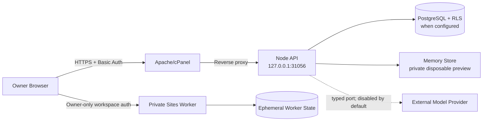

# Threat Model & Data Flow v1.0

## Scope

این مدل نسخه فعلی Single-owner Private Preview، Node/PM2 روی cPanel، PostgreSQL
اختیاری و Preview خصوصی Sites را پوشش می‌دهد. Public/Multi-user release تا Session
واقعی، دیتابیس پایدار و drill عملیاتی خارج از Scope مجاز نیست.

## Data flow و Trust Boundaryها

Trust Boundaryها:

- اینترنت ↔ Apache: تنها ورودی دامنه واقعی؛ Basic Auth فعلاً Gate موقت است.
- Apache ↔ Node: پورت Node باید فقط loopback باشد.
- Node ↔ PostgreSQL: tenant context، RLS و transaction boundary اجباری است.
- Domain ↔ Model/Tool: فقط typed port پس از policy decision؛ provider واقعی هنوز
  فعال نیست.
- Sites و cPanel دو runtime مستقل‌اند و state آنها با هم مشترک نیست.

## دارایی‌های حساس

- متن‌ها، خاطرات، Evidence، Assertion، Desired Positioning، Signalهای ادراکی و Context رابطه/Stakeholder مالک؛
- Consent، Data-right request، Draft و Approval؛
- Tenant/User identity، Audit trail و Outbox؛
- credentialهای cPanel، Basic Auth، GitHub/Sites و دیتابیس.

## Threat register

| ID | تهدید | شدت | کنترل فعلی | وضعیت / شرط انتشار |
|---|---|---:|---|---|
| T-01 | دورزدن Basic Auth از پورت عمومی Node | P0 | bind فقط روی loopback، config fail-closed، fitness test و smoke listener | بسته در `2458681`؛ هر deploy باید public port را دوباره رد کند |
| T-02 | جعل مالک به‌دلیل bootstrap identity ثابت | P0 | Basic Auth + loopback + private scope | برای Preview خصوصی پذیرفته؛ قبل از shared/public release، Session واقعی و actor binding الزامی |
| T-03 | cross-tenant read/write یا دورزدن RLS با DB role پرقدرت | P0 | tenant ID اجباری، FORCE RLS، app role بدون superuser/BYPASSRLS، readiness fail-closed و integration منفی | PostgreSQL 16 CI اثبات شده؛ Production role باید جداگانه audit شود |
| T-04 | استفاده خارج از Consent/Purpose | P0 | deny-by-default، purpose/channel، revoke/delete propagation و approval | تست‌شده؛ هر connector جدید نیازمند scope مستقل است |
| T-05 | ادعای عمومی ساختگی یا unsupported | P0 | evidence-bound Claim Registry، Draft Guard و Human approval | release fixture سبز؛ provider واقعی نیازمند eval/red-team مستقل است |
| T-11 | مخلوط‌شدن Research بیرونی با Personal Memory یا Citation کهنه/متعارض | P0 | Research store جدا، Claim پیشنهادی، freshness/conflict gate و HTTPS-only source | Fetch خودکار وب هنوز فعال نیست؛ adapter آینده نیازمند SSRF controls است |
| T-06 | Prompt injection از Asset/Research | P1 | provider واقعی غیرفعال، typed input و عدم side effect خودکار | پیش از Research/Tool integration، quarantine و tool policy لازم است |
| T-07 | افشای Secret در Git/log/export | P0 | Secret خارج Git، export redaction، Basic credential خارج archive و tracked-file secret scan | الگوهای جدید credential باید به scanner افزوده شوند |
| T-08 | حذف ناقص داده در backup/cache | P1 | soft-delete و revoke در source of truth | retention و crypto-erasure/backup expiry با دیتابیس واقعی باید drill شود |
| T-09 | از دست‌رفتن داده در memory mode | P1 | opt-in صریح و `/ready` با durability | Preview disposable؛ برای MVP پایدار PostgreSQL blocker است |
| T-10 | DB outage یا migration drift | P1 | readiness `503` و migration checks | restore/rollback واقعی هنوز به محیط PostgreSQL نیاز دارد |
| T-12 | rollback به release دارای public bind | P0 | backup + post-deploy listener/public-port smoke | Runbook باید در هر rollback همین smoke را الزام کند |
| T-13 | پرشدن دیسک و شکست backup/deploy | P1 | بررسی disk و backup قبل از deploy | دیسک فعلی سرور ۹۹٪؛ owner زیرساخت باید cleanup/ظرفیت را مدیریت کند |
| T-14 | تبدیل Citation به Verified یا ادامه انتشار Claim مورد اعتراض | P0 | Human attestation، append-only review، expected status، Draft propagation و repository re-check | Multi-review/quorum برای Scope پرریسک آینده لازم است |
| T-15 | Override شدن ریسک اعتباری/حریم خصوصی توسط Utility یا Acknowledgement کهنه | P0 | ۱۵ Risk Check نسخه‌دار، SHA-256 Assessment، Yellow attestation، Red veto، append-only review و approval re-check | مانیتورینگ بحران و Legal escalation واقعی تا Connector و incident drill خارج Scope است |
| T-16 | Prompt Injection یا Intent اشتباه در Channel گفت‌وگو که Permission را گسترش دهد یا داده حساس را ذخیره کند | P0 | ورودی untrusted، authority صریح، abstention در Confidence پایین، public-action hold، جداسازی Research/Memory و `not_persisted` برای credential | پیش از Model/Tool و Attachment integration، red-team چندزبانه، DLP و eval مستقل لازم است |
| T-17 | Override شدن Gate یک ماژول توسط Utility/Agent دیگر، استفاده از تصمیم stale یا ارتقای پنهان Autonomy | P0 | رأی‌های typed و بدون write authority، اولویت قطعی `hold/revise`، حفظ dissent/abstention، Context/Snapshot hash، پنجره ۲۴ساعته، سقف Level 5، `executionPermitted=false` و RLS/Audit | پیش از Level 6/7، Session و Delegation Scope واقعی، Tool allowlist، approval token کوتاه‌عمر، rate limit، compensation و red-team مستقل الزامی است |
| T-18 | Proactive spam، مزاحمت دست‌کاری‌گر، Cue کم‌ارتباط یا تکرار Signal stale | P0 | پیش‌فرض Reactive، opt-in مالک، Relevance threshold، Pause، سقف تراکنشی ۲۴ساعته، Context hash/staleness، Ledger توضیح‌پذیر و نبود outbound side effect | پیش از هر Notification/Connector بیرونی، Consent کانال، timezone/quiet hours، unsubscribe، delivery receipt، abuse monitoring و incident drill الزامی است |
| T-19 | تبدیل Relationship Context به CRM نظارتی، افشای داده شخص ثالث یا باقی‌ماندن متن پس از حذف | P0 | ورود دستی و رضایت مالک، بدون Contact Detail، داده confidential و purpose-bound، Boundary صریح، نبود Score/Outbound Automation، Hard Delete، Journal فقط دارای ID و Audit بدون Label/Group/Context | پیش از Contact/CRM/Calendar/360 connector، scope مستقل، third-party privacy review، field allowlist، retention، connector revocation و deletion propagation drill الزامی است |
| T-20 | تبدیل نظر دیگران به Fact، ساخت Blind Spot کاذب، افشای هویت منبع یا نظارت خودکار بر ادراک عمومی | P0 | سه Epistemic Lane مستقل، Stage کیفی بدون Score پنهان، حفظ Range تناقض، abstention در داده ناکافی، ورود دستی، بدون Source Identity/Contact/Verbatim Quote، Hard Delete و Audit فقط دارای ID | پیش از 360 Interview/Social Listening/Survey/Media connector، رضایت مستقل شخص ثالث، provenance منبع، anti-harassment/DLP review، retention و deletion propagation drill الزامی است |
| T-21 | تبدیل Narrative Candidate به Brand Fact، استفاده از Asset بدون مجوز، یا اعتماد کاذب به Anti-Generic/Voice heuristic به‌عنوان تضمین اصالت | P0 | فقط Asset دارای `brandUsage`، Seed با epistemic type و maturity محدود، Fail-closed برای Ref نامعتبر، Findingهای مستقل و توضیح‌پذیر، مرز صریح Fact/Claim/Publish Approval و `externalActionPermitted=false` | پیش از Model-based narrative inference یا auto-generation، eval چندزبانه، adversarial paraphrase set، permission re-check در لحظه generation و Human authenticity review الزامی است |
| T-22 | یکی‌گرفتن Trend با Opportunity، ساخت Filter Bubble یا تبدیل Source کهنه/متعارض به Action | P0 | پنج عامل مستقل و توضیح‌پذیر بدون Score پنهان، stale/unverified=ignore، conflict=monitor، سقف یک Exploration و مرز قطعی Strategy Review از Action/Approval | پیش از News/Social/Media connector، provenance و source allowlist، prompt-injection quarantine، rate limit، attention budget، freshness policy و Human review مستقل الزامی است |
| T-23 | پنهان‌شدن Opportunity Cost، پیشنهاد Action خارج از ظرفیت کاربر یا معتبر ماندن Decision stale | P0 | Feasibility قطعی و مستقل برای Time/Energy/Attention/Visibility/Emotional Bandwidth، Context مالک‌محور نسخه‌دار با SHA-256 و RLS، Binding تأیید به Strategy/Context/پنجره ۲۴ساعته، ابطال Approval و آزمون stale-context race؛ Utility و Opportunity Cost آشکار و `externalActionPermitted=false` | Thresholdهای پنج ظرفیت باید با User Acceptance و داده Regret/Energy کالیبره شوند؛ هیچ Engagement metric حق Override این Gateها را ندارد |
| T-24 | اجرای هم‌زمان خارج از بودجه، ثبت دوبارهٔ Charge، یا سبز نشان‌دادن هزینهٔ نامعلوم با عدد ساختگی | P0 | Reservation پیش از Spend، Lock روزانه Tenant/Owner، Idempotency fingerprint، Ledger append-only تفکیک‌شده، `costEvidence` صریح، صفر اجباری برای unmetered و Circuit Breaker در Overrun | Provider Adapter واقعی باید Reservation/Charge را اجباری و Usage گزارش‌شده را با صورتحساب مستقل reconcile کند؛ بدون نمونهٔ Metered ادعای cost/workflow pass مجاز نیست |
| T-25 | Adopt کردن Database ناشناخته/عمومی، شنود credential روی PostgreSQL بدون TLS، یا اجرای Runtime با Role مالک DDL | P0 | دو URL و Role جدا، `sslmode=verify-full` برای Host غیرمحلی، commissioning fail-closed، revoke مجوز CREATE، verification دوباره Principal/Schema/RLS و عدم چاپ URL | Production تا Provision دو Role از مالک زیرساخت، Secret injection، restore drill و بستن listener عمومی فاقد TLS موقت باقی می‌ماند |
| T-26 | دورزدن Cost/Consent/Eval توسط Provider، Retry تکراری، خروجی خارج Schema یا نسبت‌دادن هزینه ساختگی | P0 | Registry نسخه‌دار بر Purpose+Schema، Rollout و Eval fail-closed، Tenant/Owner binding، Data Class allowlist، رضایت پردازش بیرونی، Reservation اجباری، Timeout/Abort، Durable Invocation Journal metadata-only با RLS و terminal transition واحد، Charge پیش از Output validation و `unmetered` برای قیمت نامعلوم | Provider واقعی تا فعال‌شدن Journal PostgreSQL در Production، DLP/prompt-injection eval، billing reconciliation، crash/retry drill، canary rollback و تأیید مالک غیرفعال می‌ماند |

## P0 Gate

- Scope فعلی فقط زمانی مجاز است که دامنه پشت Basic Auth، Node فقط روی loopback و
  Sites owner-only باشد.
- Shared/public release با T-02 باز ممنوع است.
- Durable production با PostgreSQL تا commissioning دو Role، integration isolation test،
  TLS دارای hostname verification و restore drill ممنوع است.
- Model/Research/Publishing واقعی تا بستن T-06/T-16/T-26 و eval مربوط فعال نمی‌شود.

## Verification evidence

- Config: `PR_BIND_HOST=127.0.0.1` و رد wildcard در Production.
- Runtime smoke: listener برابر `127.0.0.1:31056`، public port مسدود، loopback `200`،
  دامنه authenticated برابر `200` و unauthenticated برابر `401`.
- Automated: policy، cross-tenant، claim guard، revocation، deletion، readiness و
  architecture fitness tests.
